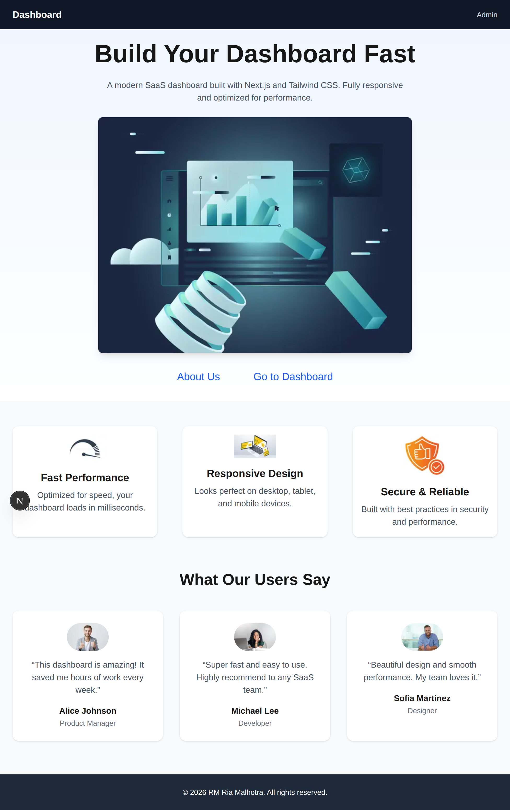
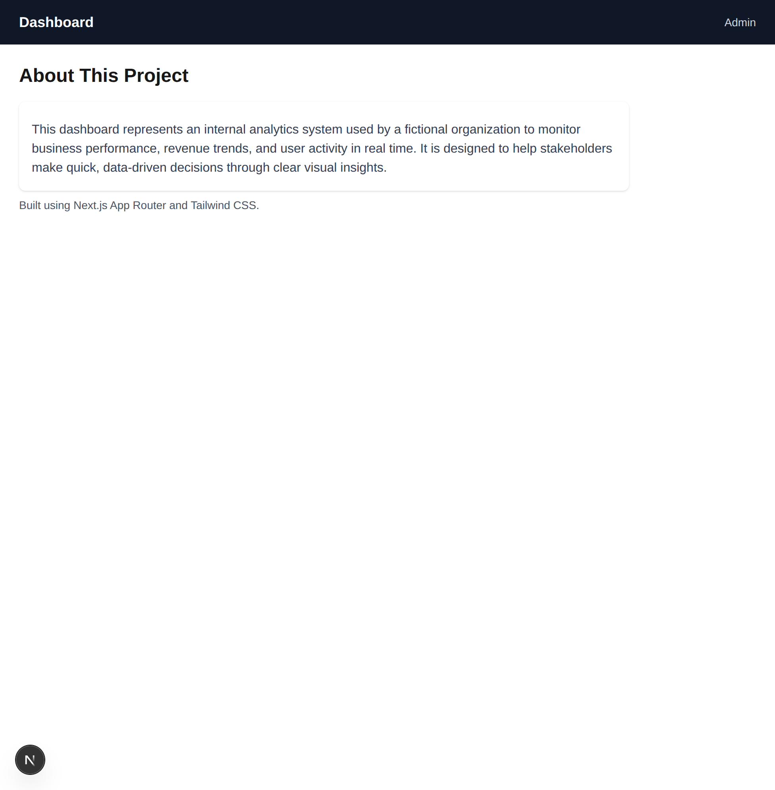
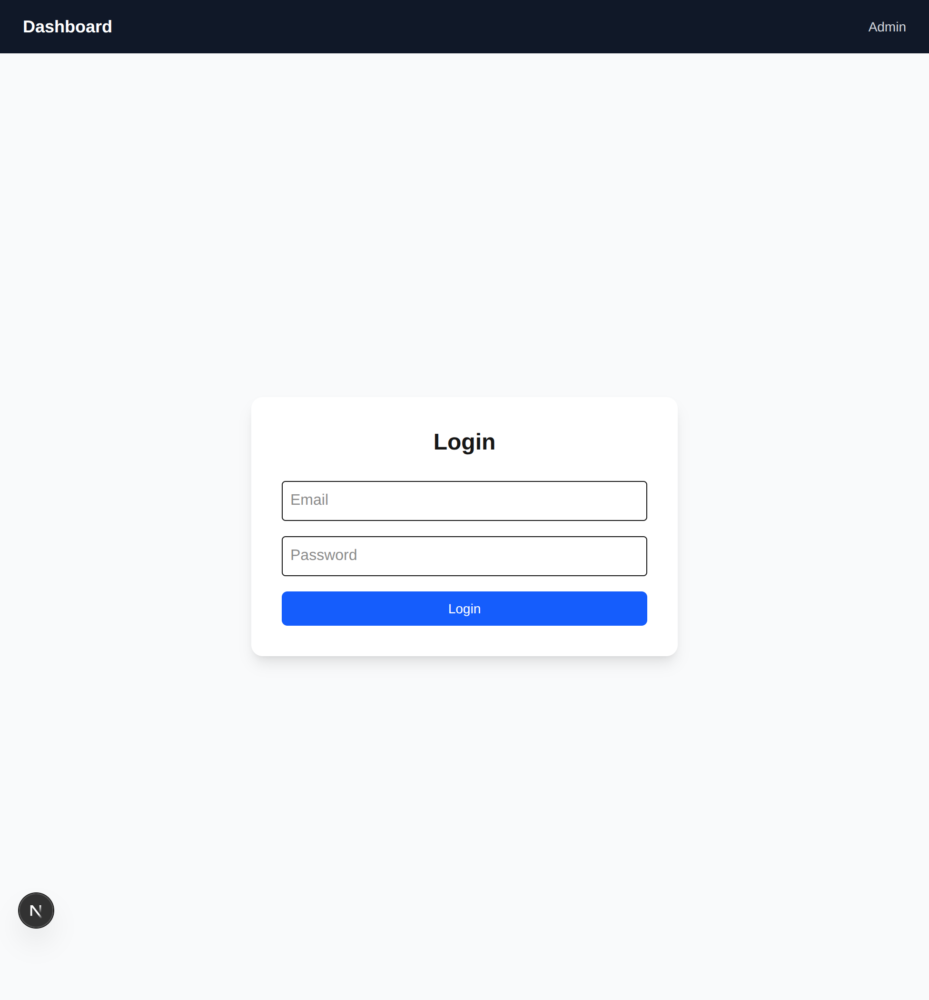
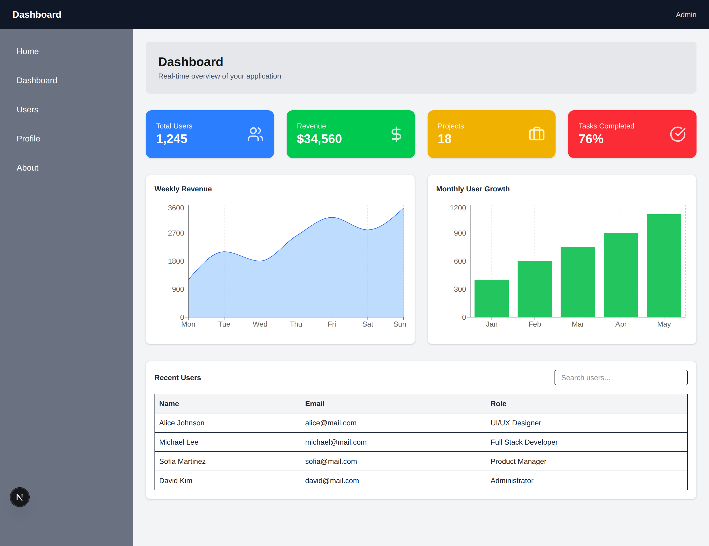
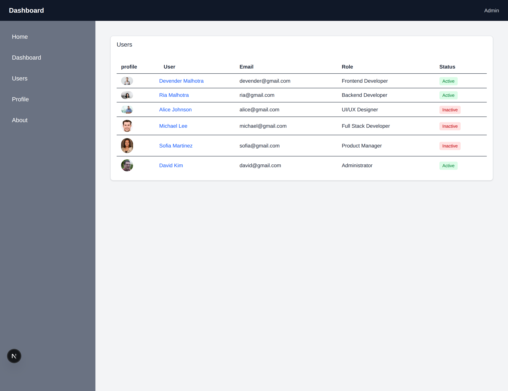
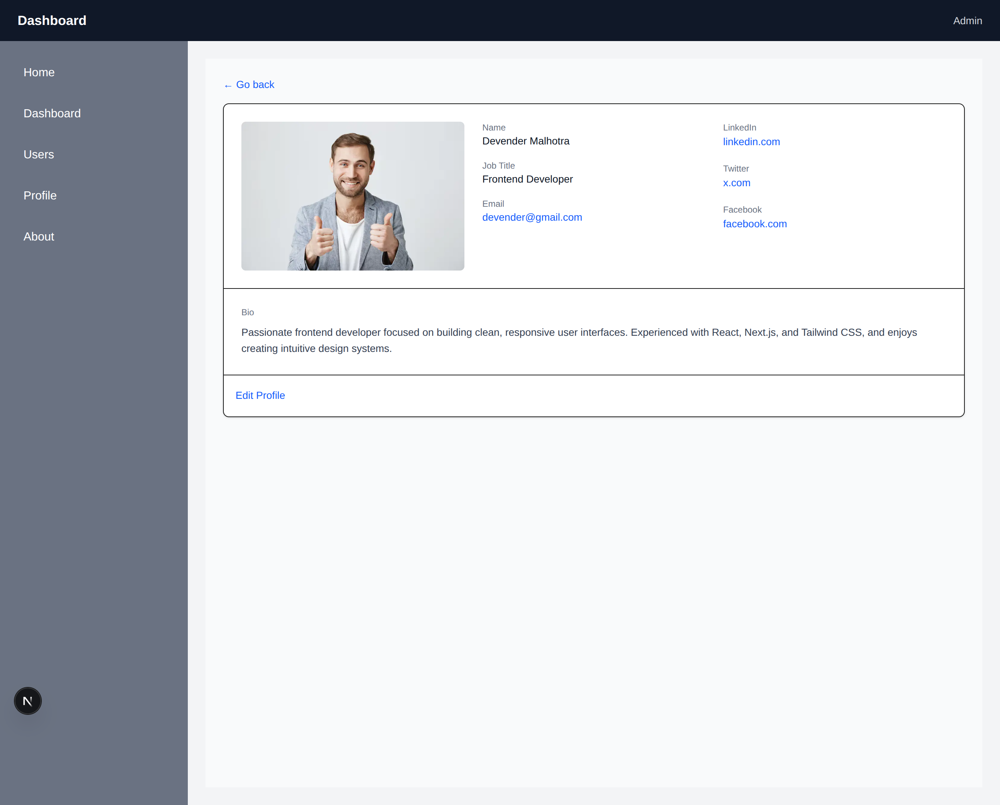

# Week 3 — Next.js + Tailwind Capstone Project

## Project Name

**week3-next-tailwind-frontend**

A fully responsive, multi-page SaaS-style frontend application built using **Next.js (App Router)** and **Tailwind CSS**, without any backend. This project focuses on UI architecture, routing, component reuse, and dashboard design.

---

## Live Features Overview


### Pages Implemented


### 1. `/app` - Landing Page

**screenshot**




### 2. `/about` - About Page

**screenshot**

  
  

### 3. `/login` — Static login form (UI only)

**screenshot**




### 4. `/dashboard` — Analytics dashboard with cards, charts, and widgets
  
**screenshot**




### 5. `/dashboard/users` — Users listing with mocked data
  
**screenshot**




### 6. `/dashboard/profile` — User profile page
  
**screenshot**



All dashboard pages share a common layout and sidebar.

---

## Tech Stack

* **Framework:** Next.js (App Router)
* **Styling:** Tailwind CSS
* **UI Components:** Reusable custom components
* **State Management:** React state (local only)
* **Backend:** None (Mock data only)

---

## 📁 Folder Structure

```
week3-next-tailwind-frontend/
│
├── app/
|   ├── about/
|   |   └── page.jsx
|   |
│   ├── login/
│   │   └── page.jsx
|   |
│   ├── dashboard/
│   │   ├── layout.tsx
│   │   ├── page.jsx
│   │   ├── users/
│   │   │   └── page.jsx
│   │   └── profile/
│   │       └── page.jsx
|   |
│   └── page.jsx (Landing Page)
│   └── layout.tsx
│   └── globals.css
├── components/
│   └── ui/
│       ├── Badge.jsx
│       ├── Button.jsx
│       ├── Card.jsx
│       ├── Input.jsx
│       ├── Modal.jsx
|       ├── Navbar.jsx
|       ├── Sidebar.jsx
│
├── data/
│   └── users.js
│
├── public/
│   └── images/
│
├── README.md
└── tailwind.config.js
```

---
## Reusable UI Components

- **Button** — Shared button styles across the app  
- **Modal** — Used for login popup  
- **Sidebar** — Dashboard navigation (used in Dashboard layout)  
- **Navbar** — Top navigation bar (used across pages)  
- **Card** — Dashboard stat cards  
- **Badge** — Status indicator for users  

---

## Dashboard Features

* Full-width dashboard header
* 4 statistics cards (Users, Revenue, Projects, Tasks)
* Area chart (Revenue over days)
* Bar chart (Monthly analytics)
* Recent users list with avatars
* Search input (UI only)

---

## Responsiveness

* Mobile-first design
* Responsive grid layouts
* Sidebar adapts to screen size
* Cards and charts stack properly on small screens

---

## Lessons Learned

* Understanding **Next.js App Router** and layouts
* Difference between **Server Components & Client Components**
* How to structure a scalable frontend project
* Component reusability and UI consistency
* Tailwind utility-first styling
* Building dashboards without backend logic

---

